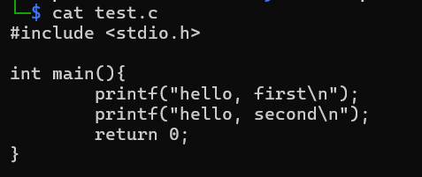
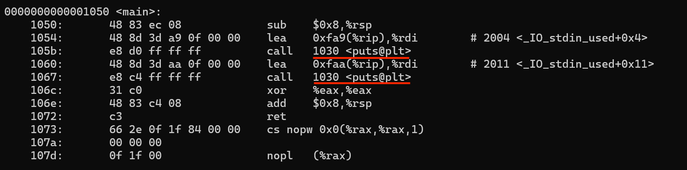
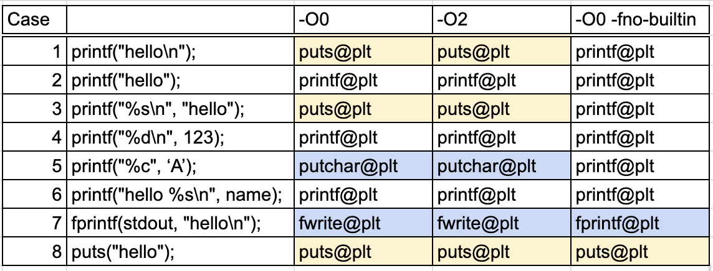

# Why Did My printf() Become puts()? Observing Compiler Transformations

## 1. Introduction
When I was studying GOT and PLT, I made a short C program to observe how the external function calls appear in a binary.

Since the source code used printf() twice, I expected to see two calls to printf@plt in the disassembly. However, I only saw `puts@plt` in the binary. 

At first, I thought I had misunderstood something about GOT and PLT. But after looking into it, I realized that the compiler had transformed my `printf` calls into `puts` calls.

I initially assumed that this was caused by compiler optimization.

That made me wonder: What source-code patterns trigger specific compiler transformations?

In this post, I explore that question by comparing small variations of `printf()` and observing how they appear in the compiled binary.

## 2.　What happened to printf()?
Compilers such as GCC (GNU Compiler Collection) convert source code into a machine-executable program. 

GCC may transform a function call into a simpler function or instruction sequence while preserving the program’s observable behavior.
Compiler options such as `-O0`, `-O2`, and `-fno-builtin` can affect these transformations. I compared the generated binaries under each configuration.

## 3. Experiment Setup
I prepared eight small C programs and compiled them with three compiler configurations: `-O0`, `-O2`, `-O0 -fno-builtin`. I compared the disassembly of the `main()` function under each configuration.

The C programs are stored in the `src/` directory.

### 3-1. Cases
01: `printf("hello\n");`  
02: `printf("hello");`  
03: `printf("%s\n", "hello");`  
04: `printf("%d\n", 123);`  
05: `printf("%c", 'A');`  
06: `printf("hello %s\n", name);`  
07: `fprintf(stdout, "hello\n");`  
08: `puts("hello");`

### 3-2. Compiler Options
`-O0 -fno-builtin`:
Disables GCC’s special built-in treatment of standard library functions.  
`-O0`:
Disables most optimization passes.  
`-O2`:
Enables a broad set of compiler optimizations.  

## 4.　Observation

With `-O0 -fno-builtin`, the original library function calls generally remained visible in the binary.

The difference between Cases 01 and 02 was particularly interesting.
Case 01 was transformed into `puts@plt`, while Case 02 remained `printf@plt`. Although the two cases differ only by the presence of `\n`, they were compiled into different function calls.
Case 03, `printf("%s\n", "hello");`, was also transformed into `puts@plt` under both `-O0` and `-O2`.

Case 05 `printf("%c", ‘A’);` was transformed into `putchar@plt` under both `-O0` and `-O2`. Because the output required only a single character and no formatting, GCC could use the simpler `putchar()` function.

Case 07, `fprintf(stdout, "hello\n")`, was transformed into `fwrite@plt` under both `-O0` and `-O2`.
Because the output stream, string, and output size were all known, GCC transformed the call into `fwrite()`.

## 5.　Key Insight
When I researched the meaning of `-O0`, I often found descriptions such as “disables optimization.” However, function substitutions still occurred under `-O0`, and the call targets were identical under `-O0` and `-O2`. With `-fno-builtin`, the original function calls remained. This suggests that the transformation depended on GCC’s built-in recognition of standard library functions, not only on the selected optimization level.

A seemingly small source-code detail such as \n can therefore affect the generated function call.

## 6.　Additional Experiments
I also learned about four other types of compiler transformations. I performed two additional small experiments to observe constant folding and inline expansion.

### 6-1. Constant Folding with strlen()
I prepared two sample programs using `strlen()` and compared them under the same three compiler configurations.
In the literal case, the `strlen()` call disappeared under both `-O0` and `-O2`. At `-O0`, the value `5` was first stored in a local stack variable. At `-O2`, it was passed directly to `printf()`.

With `-O0 -fno-builtin`, the call remained as `strlen@plt`. In the runtime-input case, `strlen@plt` remained under all three conditions.

### 6-2. Inline Expansion of memcpy()
I prepared two sample programs using `memcpy()` and compared them under the same three configurations.

In the fixed-size case, the `memcpy()` call disappeared under both `-O0` and `-O2`. At `-O0`, the copy was expanded into direct load and store instructions using `mov`. At `-O2`, GCC simplified it further by writing the final constant value directly to the destination buffer.

With `-O0 -fno-builtin`, the call remained as `memcpy@plt`. In the runtime-size case, `memcpy@plt` remained under all three conditions.

### 6-3. Two Other Compiler Behaviors
Other compiler transformations include dead code elimination and restructuring loops or branches. These were outside the scope of this experiment.

## 7. Conclusion
Before this experiment, I had not considered how small source-code differences such as `\n` or `%s` could produce different function calls in the compiled binary.

I noticed that:

- A source-level call to `printf()` does not always remain a call to `printf@plt` in the compiled binary.
- Compiler transformations were observed even under `-O0`.
- The compiler had previously felt like a black box to me, but this experiment gave me a first look at the decisions made during compilation.
  
This experiment made me more interested in the internal structure of compilers. I plan to explore this topic further in future experiments.
